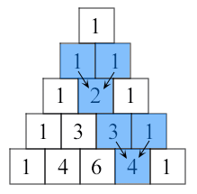

# Activity: Python Function Practice Part 4

In this activity we are going to practice writing functions in Python. The prompts have been listed below. Work must be completed in [HW_2_Python_Function_Practice_Part_4.py](HW_2_Python_Function_Practice_Part_4.py) using a local code editor, and should be pushed to GitHub. Be sure to submit a direct link to this file from your GitHub repository on Canvas when you are finished.

For each of the functions described below, plan the best way to write the function. Remember that there may be a recursive and an iterative solution to many problems. The best solution to any problem is the solution that you understand best. As long as your function is named correctly, accepts the correct parameters, and returns the correct output, you can be confident that you have succeeded at your task.

## Write the Following Functions

- Write a Python function called `max_num()` to find the maximum of three numbers.
- Write a Python function called `mult_list()` to multiply all the numbers in a list.
- Write a Python function called `rev_string()` to reverse a string.
- Write a Python function called `num_within()` to check whether a number falls in a given range.
  - The function accepts the number, beginning of range, and end of range (inclusive) as arguments.
  - Examples: `num_within(3,2,4)` returns `True`, `num_within(3,1,3)` returns `True`, `num_within(10,2,5)` returns `False`.
- Write a Python function called `pascal()` that prints out the first n rows of Pascal's triangle.
  - The function accepts the number n, the number of rows to print
  - Note : Pascal's triangle is an arithmetic and geometric figure first imagined by Blaise Pascal. Each number is the two numbers above it added together.

### Sample Pascal's Triangle



### Sample output

```python
def pascal():
    #your code here

pascal(1)
'''
output:
1
'''

pascal(5)
'''
output:
1
1 1
1 2 1
1 3 3 1
1 4 6 4 1
'''
```

## Acceptance Criteria

- Each of the functions described exists in the Python file.
- Each of the functions is named correctly, accepts the correct parameters, returns the correct output, and has been called inside the file (so that each function runs automatically when the file is run).
- The file runs with no errors.

Before submitting, make sure you do a self review of your code, check for formatting, spelling, include comments in your code, and ensure you have a healthy commit history.

Make sure to submit your GitHub repository link on Canvas.

## Solution

If you get stuck or want to check your work, check out the [solution guide](HW_2_Python_Function_Practice_Part_4_Solution.py).
