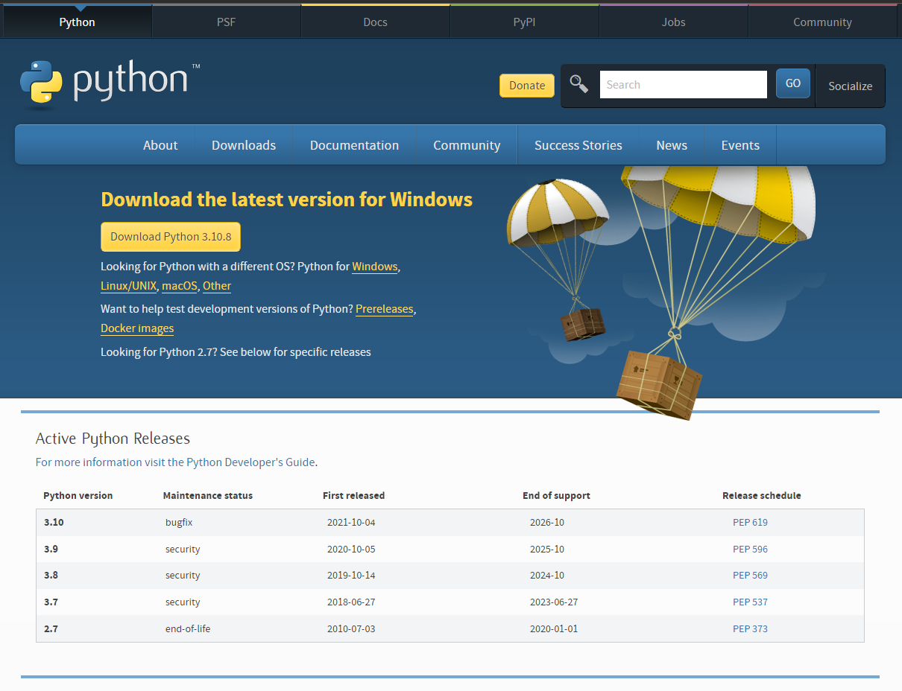

# Local Python Setup and Function Practice

In this activity, we walk you through setting up Python on your local machine.

Although we can write and run Python programs online on systems like Replit, we gain more flexibility over our environment when we have it locally installed. Running code from local files (files stored on your personal computer) is also more like what you would be doing professionally, and will allow you to put your code on GitHub like we have been doing with our JavaScript projects.

Because we already have our computer set up for JavaScript, setting up for Python won't be very difficult. Below, we walk you through the steps for installing Python, depending on whether you are using a Mac, PC, or Linux machine. We won't need to install any extra IDE because we already have VSCode installed.

**There are two major versions of Python; Python 2 and Python 3. Python 3 is the industry standard, and is what people refer to when they say 'Python', unless they explicitly say otherwise. Be careful to always run your code under Python 3!**

## Python installation for Mac or Linux

First, run the following code in your terminal:

```powershell
python3 --version
```

If you get any output that looks like "Python 3.x.x" (the x's will be numbers, but they change with updates), Python is already installed on your system. Make sure to test that pip is also installed, but otherwise you can skip to the "Test Python" section.

If you do not already have Python installed on your computer, you will get an error in response to this command. In that case, open [Python.org Downloads](https://www.python.org/downloads). This will automatically detect your OS and show you an option to download the latest stable version of Python 3.x.x, which at the time of writing this activity is 3.10.2.



If the website detects your OS incorrectly, click the appropriate link for your OS, then the "Latest Python 3 Release" link. Once the correct OS is selected, click on the yellow "Download Python 3.x.x" button. This will download a .dmg (Mac), .exe (PC), or .tar (Linux) file. Open the file and follow the prompts to install Python 3 on your machine.

In the installer, make sure to select the “Install launcher for all users” and “Add Python 3.x to PATH” checkboxes, then follow the recommended installation options.

You may be prompted to "Disable path length limit". Please follow the instructions to do this if prompted.

## Python installation for Windows

First, open your Git Bash terminal. Type in the following command:

```powershell
python3 --version
```

If your Git Bash terminal outputs something that looks like 'Python 3.x.x' (the x-es will be numbers, 3.10.2 at time of writing), then Python is already installed. Otherwise, continue with the next step.

If Python isn't installed yet, type "python3" into your Git Bash terminal. This should open the Windows Store. You will be shown a page for Python that has a blue "get" button. Click the "get" button and wait for python to finish installing.

Once Python has finished installing, restart your Git Bash terminal. running the command shown above, "python3 --version", should yield output of "Python 3.x.x".

## Test pip Installation

At this point, installing Python should have already installed pip, our python package installer. To test that pip is installed correctly, open your terminal of choice (Terminal on Mac/ Linux, Git Bash on Windows) and type in:

```powershell
pip3 --version
```

The output should be "pip x.x.x from ..." followed by a long file path. The x.x.x at time of writing is 21.0.3, but your numbers may be different. If pip is not working, ask an instructor for assistance in fixing your setup.

**Pip is a very important piece of your Python setup. Colloquially, we will refer to and write "pip" throughout the course. Whenever you see this, make sure to type "pip3" into your terminal, just as you type "python3" instead of "python". The reason is that "pip" will install packages for Python 2, which we will not be using.**

## Testing Python

To test our Python installation, we will be performing two tasks. The first is writing and running a simple test line of code in our terminals, and the other is running a simple Python file from our terminals.

### Run Code in Terminal

To run Python code in our terminal, follow the following steps:

- In your terminal, type python3. This should open the Python program in your terminal. To exit at any time, type `exit()` followed by the Enter key.
- In your terminal, type `print("Hello World")` and hit Enter. The output, shown below the line of code you just ran, should say `Hello World`.
- Play with writing code in the Python interpreter in your terminal. Writing blocks of code, such as functions, is possible but clunky, and nothing done in the interpreter will be saved. For this reason, we will be practicing writing and running code files. Remember, to exit at any time, type exit and hit Enter.

### Creating and Running Python Files

To create a Python file, follow these steps:

- In your file browser, navigate to the directory where you have been storing your JS projects.
- Create a new directory, called `python_projects`.
- In VSCode, open a new file, and save it to your Python projects folder as `python_setup.py`.
- In your file, type `print("Hello from inside a file!")`, then save your file.
- In your terminal, navigate to your `python_projects` folder, then type `python3 python_setup.py`. You should get output in your terminal that says `Hello from inside a file!`

## Functions Practice

At this point, you should feel confident that you can create a Python file and run it from your terminal. We will be utilizing this skill in the next portion of the activity.

This activity is not designed to trick you or confuse you in any way. Rather, it is designed to help you gain confidence that the skills you've already learned and practiced in Replit can be applied in Python programming on your personal computer as well.

Follow the steps below to create a Python file which you will submit to your instructor.

- In your Python projects folder, create a new file called functions_practice.py.
- Open your file in VSCode, and create the following functions:
  - A function named hello() that prints a greeting to the user. This function should accept no arguments and returns nothing.
  - A function named pack() that accepts three arguments, and returns a single list with the three arguments inside as list elements.
  - A function called eat_lunch(). This function should accept a list of any length, and print out a series of strings that say `First I eat __ (the first element of the list)`, and `Next I eat ___ (for the following elements in the list)`. If the list is empty, print `My lunchbox is empty!`. The function should not return anything.
- Test that your file works by running it in your terminal. Remember, you need to call your functions in order for them to run. Make sure that all three functions run (please print the output of `pack()`) before submitting the file.

When your file is completed, follow your normal process to add, commit, and push the changes to your local directory up to your GitHub repository. Don't forget to also submit the assignment on Canvas!

## Acceptance Criteria

- Three functions, `hello()`, `pack()`, and `eat_lunch()` are present in the file.
- The three function perform their described tasks, and have been called inside the file.
- The file runs with no errors.

Before submitting, make sure you do a self review of your code, check for formatting, spelling, include comments in your code, and ensure you have a healthy commit history.

Make sure to submit your GitHub repository link on canvas.

## Solution

If you get stuck, or want to check your work, please refer to the [solution repository](https://github.com/HackerUSA-CE/PPP-Local-Python-Setup-and-Function-Practice/tree/main) on GitHub.
